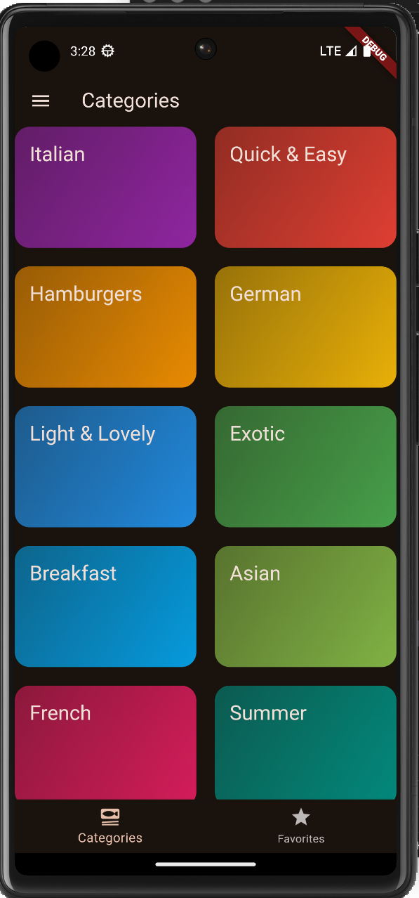

# meals-app
Meals App - A Flutter-Powered Recipe and Meal Planner

The Meals App is a beautifully designed, user-friendly application built with Flutter, offering a seamless experience for discovering, planning, and managing meals. The app is perfect for anyone looking to explore new recipes, organize meal plans, or get inspired in the kitchen.

Key Features:

	•	Browse a Wide Variety of Recipes:  vegetarian, vegan, gluten-free, and more.
	•	Favorite and Bookmark Recipes: Save your favorite recipes with a single tap to quickly access them anytime.
	•	Detailed Recipe Instructions: Each recipe includes step-by-step instructions, ingredient lists, cooking tips, and preparation time, making it easy to follow along.
	•	Filter Recipes: Easily filter recipes based on dietary preferences (e.g., vegetarian, vegan, dairy-free,) to find exactly what you’re looking for.
	•	Beautiful UI: A clean, modern interface that provides an intuitive browsing experience with high-quality food images.


Technology Stack:

	•	Flutter: Cross-platform framework used to create a smooth and responsive UI for both Android and iOS.
	•	Dart: Programming language used with Flutter for building the app.
	
Target Audience:

The app is designed for food enthusiasts, home cooks, or anyone interested in exploring new recipes and managing their meals with ease.

##screenshots


## Installation

To run this project locally on your machine, follow these steps:

### Prerequisites:
- [Flutter](https://flutter.dev/docs/get-started/install) (ensure Flutter SDK is installed)
- [Android Studio](https://developer.android.com/studio) or Xcode (for iOS)

### Steps:

1. Clone this repository:
   ```zsh
   git clone https://github.com/yourusername/your-repo.git

	2.	Navigate into the project directory:

cd your-repo


	3.	Install dependencies:

flutter pub get


	4.	Run the app:

flutter run
Now, the app should open in your emulator or device!

